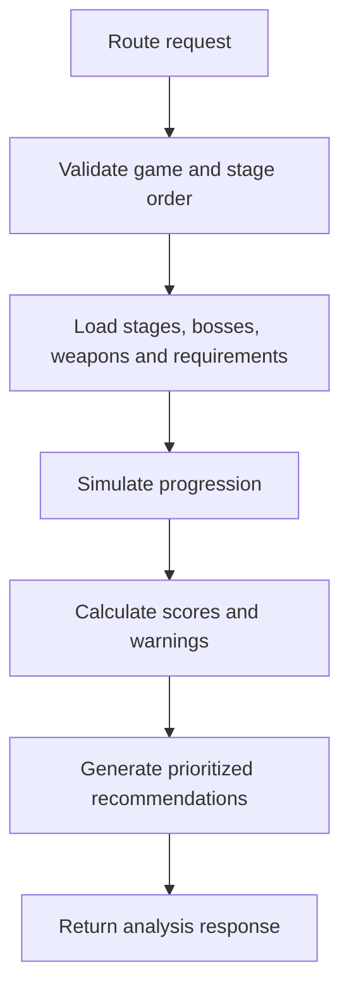
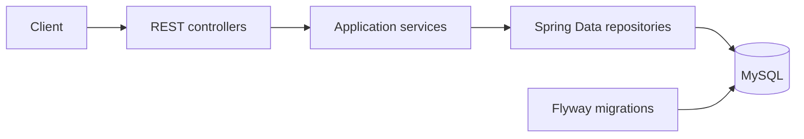
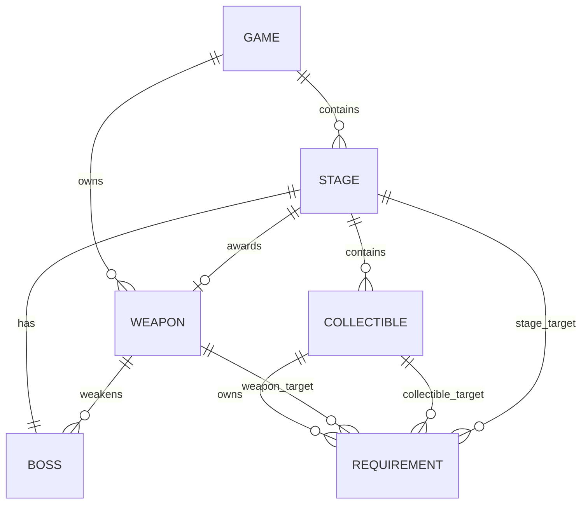

# Maverick Labs API
[](https://github.com/Danyaell/maverick-labs-be/actions/workflows/ci.yml)
> A data-driven backend for exploring Mega Man X game data, validating player-defined boss routes, estimating route difficulty, detecting backtracking, and generating actionable recommendations.


Maverick Labs turns static game information into a normalized dependency graph that can answer practical route-planning questions:

- Which bosses should be defeated first?
- Will the selected order make a boss easier because its weakness is already available?
- Which collectibles cannot be obtained on the first visit?
- How much backtracking does the route introduce?
- What changes would improve the route?

This repository contains the Java/Spring Boot backend. The companion React application is available at [maverick-labs-fe](https://github.com/Danyaell/maverick-labs-fe).

## Table of contents

- [Project status](#project-status)
- [Features](#features)
- [How route analysis works](#how-route-analysis-works)
- [Tech stack](#tech-stack)
- [Architecture](#architecture)
- [Domain model and data integrity](#domain-model-and-data-integrity)
- [Getting started](#getting-started)
- [API reference](#api-reference)
- [Database migrations](#database-migrations)
- [Testing](#testing)
- [Configuration](#configuration)
- [Project structure](#project-structure)
- [Current limitations](#current-limitations)
- [Roadmap](#roadmap)
- [Contributing](#contributing)
- [License and disclaimer](#license-and-disclaimer)

## Project status

Maverick Labs is under active development. The current backend provides a complete vertical slice for the eight modeled Maverick stages in the original **Mega Man X**:

| Data | Current coverage |
|---|---:|
| Games in the catalog | 8 (`MMX` through `MMX8`) |
| Fully modeled games | 1 (`MMX`) |
| MMX Maverick stages | 8 |
| Bosses | 8 |
| Boss weapons | 8 |
| Collectibles | 17 |
| Normalized collectible requirements | 39 |

`MMX2` through `MMX8` are already represented in the catalog, but their detailed stage data has not been added yet. Route analysis currently targets `MMX`.

## Features

### Game catalog

- Returns the eight main Mega Man X games in release order.
- Exposes stable game codes such as `MMX`, `MMX2`, and `MMX8`.
- Supports case-insensitive lookup by game code.

### Detailed game data

- Maverick stages and their ordering.
- Bosses and normalized weapon weaknesses.
- One weapon reward per modeled stage.
- Collectibles, descriptions, display order, and asset keys.
- DTO-based responses that do not expose internal database identifiers.

### Route analyzer

- Validates unknown and duplicate stages.
- Requires every modeled stage for the `HUNDRED_PERCENT` goal.
- Tracks acquired weapons, collectibles, and cleared stages by database ID.
- Applies boss weakness reductions only when the corresponding weapon has already been obtained.
- Detects collectibles whose requirements are unavailable during the current visit.
- Calculates difficulty, backtracking, time, and route-efficiency scores.

### Recommendations

- `BOSS_ORDER`: identifies boss-order improvements and successful weakness setups.
- `BACKTRACKING`: highlights stages that may require another visit.
- `ROUTE_EFFICIENCY`: provides a general warning when backtracking is high and more specific advice is unavailable.
- Prioritizes warnings, removes equivalent recommendations, and limits the response size.

### Production-oriented persistence

- Flyway owns all schema changes and seed data.
- Hibernate runs with `ddl-auto: validate` and never updates the schema automatically.
- `open-in-view` is disabled.
- Composite foreign keys enforce that stages, bosses, weapons, collectibles, and requirements belong to the same game.
- MySQL `CHECK`, `UNIQUE`, and foreign-key constraints protect domain integrity independently of application code.

## How route analysis works



During simulation, the service maintains three progression sets:

- acquired weapon IDs;
- acquired collectible IDs;
- cleared stage IDs.

A stage weapon becomes available after completing its provider stage. A collectible is considered obtainable only when all its modeled requirements are satisfied at that point in the route.

For boss encounters, the stage's base difficulty is multiplied by `0.65` when the boss weakness has already been acquired. Otherwise, the full base difficulty is used. Missing collectible requirements add backtracking pressure, which is capped to a `0-100` score and contributes to the time and route-efficiency breakdown.

## Tech stack

| Area | Technology |
|---|---|
| Language | Java 21 |
| Framework | Spring Boot 4.1.0 |
| HTTP API | Spring MVC |
| Persistence | Spring Data JPA / Hibernate |
| Database | MySQL 8 |
| Database migrations | Flyway |
| Validation | Jakarta Bean Validation |
| Build tool | Maven Wrapper |
| Unit testing | JUnit 5, Mockito, AssertJ |
| HTTP contract testing | MockMvc |
| Database integration testing | Testcontainers with MySQL 8.0.42 |
| Documentation | OpenAPI 3.1, Swagger UI |

## Architecture

The application follows a layered structure with explicit API DTOs and constructor injection:



- **Controllers** define the HTTP contract and validate requests.
- **Services** own route simulation, mapping, and recommendation rules.
- **Repositories** provide focused JPA queries and fetch plans.
- **DTOs** keep the public API independent from persistence entities.
- **Flyway migrations** are the source of truth for schema and reference data.

## Domain model and data integrity



### Main invariants

- Game codes and release positions are unique.
- Stage slugs and stage order are unique inside a game.
- A stage has at most one boss and awards at most one weapon.
- Boss weakness references point to weapons from the same game.
- Collectibles must belong to the same game as their stage.
- Requirement owners and targets must belong to the same game.
- A requirement target is determined by its type:
  - `WEAPON` -> `required_weapon_id`;
  - `COLLECTIBLE` -> `required_collectible_id`;
  - `STAGE_CLEARED` -> `required_stage_id`;
  - `OTHER` -> textual description without a relational target.
- Collectible requirements cannot reference their own collectible.
- Difficulty is constrained to `0–100`; stage order, estimated time, and release order must be positive.

The schema uses InnoDB, `utf8mb4`, and `utf8mb4_unicode_ci`.

## Getting started

### Prerequisites

- JDK 21
- MySQL 8.0+
- Git
- Docker Desktop or another Docker-compatible runtime, only when running the integration test suite

The Maven Wrapper is included, so a global Maven installation is optional.

### 1. Clone the repository

```bash
git clone https://github.com/Danyaell/maverick-labs-be.git
cd maverick-labs-be
```

### 2. Create an empty database

Flyway creates the tables and loads the initial data, but the database itself must exist:

```sql
CREATE DATABASE maverick_labs
    CHARACTER SET utf8mb4
    COLLATE utf8mb4_unicode_ci;
```

For example:

```bash
mysql -u root -p -e "CREATE DATABASE maverick_labs CHARACTER SET utf8mb4 COLLATE utf8mb4_unicode_ci;"
```

### 3. Configure the datasource

The application uses standard Spring Boot environment variables.

#### PowerShell

```powershell
$env:SPRING_DATASOURCE_URL = "jdbc:mysql://localhost:3306/maverick_labs?useSSL=false&allowPublicKeyRetrieval=true&serverTimezone=UTC"
$env:SPRING_DATASOURCE_USERNAME = "root"
$env:SPRING_DATASOURCE_PASSWORD = "your_password"
```

#### Bash, zsh, or Git Bash

```bash
export SPRING_DATASOURCE_URL='jdbc:mysql://localhost:3306/maverick_labs?useSSL=false&allowPublicKeyRetrieval=true&serverTimezone=UTC'
export SPRING_DATASOURCE_USERNAME='root'
export SPRING_DATASOURCE_PASSWORD='your_password'
```

Do not commit real database credentials. For shared or production environments, provide them through the deployment platform's secret manager.

### 4. Run the application

#### Windows

```powershell
.\mvnw.cmd spring-boot:run
```

#### Linux or macOS

```bash
./mvnw spring-boot:run
```

On startup:

1. Flyway validates and applies pending migrations.
2. V1 creates the schema and integrity constraints.
3. V2 loads the game catalog and the initial MMX dataset.
4. Hibernate validates that the entity mappings match the migrated schema.

The API is available by default at `http://localhost:8080`.

### 5. Verify the installation

```bash
curl http://localhost:8080/api/v1/games
```

## API reference

### Interactive API documentation

The running application publishes its HTTP contract automatically from the
Spring MVC controllers and public DTOs.

| Resource | Local path |
|---|---|
| Swagger UI | http://localhost:8080/swagger-ui.html |
| OpenAPI JSON | http://localhost:8080/v3/api-docs |
| OpenAPI YAML | http://localhost:8080/v3/api-docs.yaml |

Production documentation:

- [Swagger UI](https://maverick-labs-be-production.up.railway.app/swagger-ui.html)
- [OpenAPI JSON](https://maverick-labs-be-production.up.railway.app/v3/api-docs)

### Base URL

```text
http://localhost:8080/api/v1
```

### List games

```http
GET /games
```

Returns every game ordered by `releaseOrder`.

```bash
curl http://localhost:8080/api/v1/games
```

Example response:

```json
[
  {
    "code": "MMX",
    "title": "Mega Man X",
    "releaseOrder": 1
  },
  {
    "code": "MMX2",
    "title": "Mega Man X2",
    "releaseOrder": 2
  }
]
```

### Get game detail

```http
GET /games/{gameCode}
```

`gameCode` is case-insensitive.

```bash
curl http://localhost:8080/api/v1/games/MMX
```

Example response excerpt:

```json
{
  "code": "MMX",
  "title": "Mega Man X",
  "releaseOrder": 1,
  "stages": [
    {
      "slug": "chill-penguin",
      "name": "Chill Penguin Stage",
      "stageOrder": 1,
      "imageAssetKey": "mmx.stage.chill-penguin",
      "boss": {
        "slug": "chill-penguin",
        "name": "Chill Penguin",
        "imageAssetKey": "mmx.boss.chill-penguin"
      },
      "weaponReward": {
        "slug": "shotgun-ice",
        "name": "Shotgun Ice",
        "description": "Fires ice projectiles that split when they hit a target.",
        "imageAssetKey": "mmx.weapon.shotgun-ice"
      },
      "collectibles": [
        {
          "slug": "leg-upgrade-capsule",
          "name": "Leg Upgrade",
          "type": "ARMOR_UPGRADE",
          "description": "Unlocks dash movement and longer dash jumps.",
          "imageAssetKey": "mmx.collectible.leg-upgrade",
          "sortOrder": 1
        }
      ]
    }
  ]
}
```

### Analyze a route

```http
POST /routes/analyze
Content-Type: application/json
```

The only currently supported goal is `HUNDRED_PERCENT`, which requires all eight modeled MMX Maverick stages exactly once.

```bash
curl -X POST http://localhost:8080/api/v1/routes/analyze \
  -H "Content-Type: application/json" \
  -d '{
    "gameCode": "MMX",
    "stageOrder": [
      "chill-penguin",
      "storm-eagle",
      "flame-mammoth",
      "spark-mandrill",
      "armored-armadillo",
      "launch-octopus",
      "boomer-kuwanger",
      "sting-chameleon"
    ],
    "goal": "HUNDRED_PERCENT"
  }'
```

Example response:

```json
{
  "gameCode": "MMX",
  "difficultyScore": 47,
  "difficultyLabel": "MEDIUM",
  "backtrackingScore": 80,
  "estimatedMinutes": 140,
  "warnings": [
    {
      "type": "MISSING_REQUIREMENT",
      "message": "Collectible Heart Tank may require revisiting Chill Penguin Stage later.",
      "stageSlug": "chill-penguin",
      "collectibleSlug": "chill-penguin-heart-tank"
    }
  ],
  "breakdown": {
    "baseDifficultyAverage": 65,
    "combatDifficulty": 47,
    "weaknessReduction": 18,
    "routeEfficiencyScore": 66,
    "timePenaltyMinutes": 20
  },
  "recommendations": [
    {
      "type": "BACKTRACKING",
      "severity": "WARNING",
      "message": "You may need to revisit Chill Penguin to collect all items.",
      "relatedStages": [
        "chill-penguin"
      ]
    }
  ]
}
```

Scores and recommendations depend on the submitted order. The example only shows one warning and one recommendation; a response may contain multiple entries.

### Error responses

Errors use a stable two-field shape:

```json
{
  "status": 400,
  "message": "stageOrder cannot be empty"
}
```

| Status | Meaning |
|---:|---|
| `400` | Invalid payload, duplicated stage, unknown stage, or incomplete `HUNDRED_PERCENT` route |
| `404` | Game code was not found |
| `500` | Unexpected server error; internal details are not exposed to the client |

## Database migrations

Migration files are stored in:

```text
src/main/resources/db/migration
```

| Migration | Responsibility |
|---|---|
| `V1__create_schema.sql` | Tables, indexes, unique constraints, checks, and same-game composite foreign keys |
| `V2__seed_initial_game_data.sql` | Eight-game catalog plus detailed MMX stages, bosses, weapons, collectibles, and requirements |

Important rules:

- Start the application against an existing, empty MySQL database on a fresh installation.
- Do not edit an applied versioned migration in a shared or production database.
- Add a new migration such as `V3__description.sql` for every subsequent schema or reference-data change.
- Hibernate is configured with `ddl-auto: validate`; it must not be changed to `update` or `create` as a replacement for Flyway.
- Flyway clean is disabled to protect data.

Flyway records applied versions and checksums in `flyway_schema_history`.

## Testing

The project deliberately uses the same database engine in tests and production-like execution. H2 is not used.

### Test categories

- **Unit tests** for `GameService`, `RouteAnalysisService`, and `RecommendationService`.
- **Controller contract tests** using MockMvc and the global exception handler.
- **Repository integration tests** against MySQL.
- **Flyway smoke tests** that migrate an empty schema and verify seed counts.
- **Integrity tests** that prove unique, check, and same-game foreign-key constraints reject invalid data.
- **Seed integration tests** that exercise the real MMX dataset through services and repositories.
- **JPA propagation tests** that verify Hibernate writes the propagated `game_id` values correctly.

### Run the test suite

Docker must be running. Testcontainers starts an isolated `mysql:8.0.42` container automatically; your local development database is not used.

#### Windows

```powershell
.\mvnw.cmd clean test
```

#### Linux or macOS

```bash
./mvnw clean test
```

### Build the application

```bash
./mvnw clean package
```

Windows:

```powershell
.\mvnw.cmd clean package
```

Run the packaged application:

```bash
java -jar target/maverick-labs-be-0.0.1-SNAPSHOT.jar
```

## Configuration

| Property / environment variable | Required | Default                 | Purpose |
|---|:---:|-------------------------|---|
| `SPRING_DATASOURCE_URL` | Yes | -                       | JDBC URL for the MySQL database |
| `SPRING_DATASOURCE_USERNAME` | Yes | -                       | Database username |
| `SPRING_DATASOURCE_PASSWORD` | Yes | -                       | Database password | `SERVER_PORT` | No | `8080` | HTTP server port |
| `APP_CORS_ALLOWED_ORIGINS` | No | `http://localhost:5173` | Allowed frontend origins; comma-separate multiple values when externally configured |

Default CORS configuration permits the local Vite frontend at `http://localhost:5173`. Override allowed origins in deployed environments.

Key persistence settings:

```yaml
spring:
  jpa:
    hibernate:
      ddl-auto: validate
    open-in-view: false
  flyway:
    enabled: true
    validate-on-migrate: true
    clean-disabled: true
```

## Project structure

```text
src/
    main/
        java/com/danyaell/mavericklabsbe/
            common/
                dto/                  # Shared API responses
                exception/            # Global exception handling
            config/                   # CORS configuration
            game/
                controller/           # REST endpoints
                dto/                  # Public API contracts
                entity/               # JPA domain model
                exception/            # Game-domain exceptions
                repository/           # Spring Data repositories
                service/              # Catalog, analysis, and recommendations
        resources/
            db/migration/             # Flyway schema and seed migrations
            application.yaml          # Application configuration
    test/
        java/com/danyaell/mavericklabsbe/
            game/                     # Controller, service, repository, and integration tests
            support/                  # MySQL Testcontainers and Flyway tests
        resources/
            application-test.yaml     # Test profile
```

## Current limitations

- Detailed content and route analysis are currently available only for the eight modeled Maverick stages in `MMX`.
- `HUNDRED_PERCENT` is the only route goal.
- Multiple rows for one collectible are interpreted as `AND`. Alternative acquisition strategies are intentionally represented by one canonical route for now.
- `OTHER` requirements cannot be evaluated automatically. They remain unsatisfied and produce a revisit warning; this is used for conditions such as the Hadouken's full-health and repeated-visit behavior.
- The analyzer models Maverick stages and collectible dependencies, not Sigma fortress stages, lives, health consumption, execution skill, or speedrun-specific techniques.

## Roadmap

- Add detailed stages, bosses, weapons, collectibles, and requirements for `MMX2` through `MMX8`.
- Support additional route goals and partial-route analysis.
- Model alternative requirements with explicit `AND`/`OR` groups.
- Expand recommendation rules and explain score contributions in greater detail.
- Add continuous integration and deployment workflows.
- Complete the route builder and analyzer experience in the companion frontend.

## Contributing

Contributions and review suggestions are welcome.

1. Create a focused branch.
2. Keep controllers thin and place domain behavior in services or entities.
3. Add or update tests for behavioral changes.
4. Use a new Flyway migration for schema or seed changes; never rewrite applied migrations.
5. Run the complete test suite before opening a pull request.

## License and disclaimer
Maverick Labs is a fan-made educational and portfolio project. Mega Man, Mega Man X, character names, and related properties belong to their respective trademark and copyright owners. This project is not affiliated with or endorsed by Capcom.

## Author

Created by [Danyaell Martínez Ortiz](https://github.com/Danyaell).
